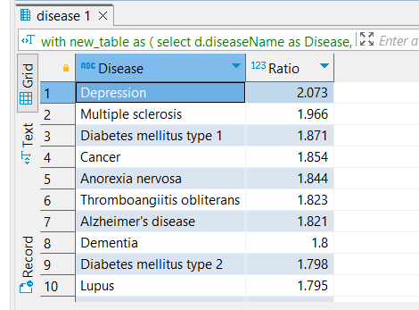
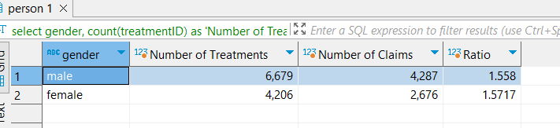

# Canada-Healthcare-Database-Analysis
Conducted a comprehensive analysis of Canada's healthcare dataset (2018-2022), utilizing MySQL to work with multiple interconnected tables and schemas efficiently.

Please find a few screenshots of the analysis below.

